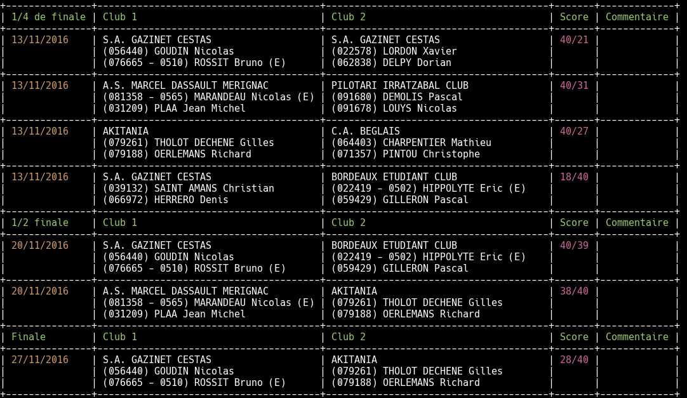

# Paleta

[![License Apache 2][badge-license]](LICENSE)

* Master : 
* Develop : 

This tool is a simple CLI to display informations about Pelota competitions for the terminal.
Supported leagues are :

* [x] [Côte d'Argent](http://www.lcapb.net/)
* [x] [Pays Basque](http://www.comite-pelote-basque.eus/fr/)
* [ ] [Landes](http://www.llpb.fr/)
* [x] [Béarn](http://liguebearnpelote.fr/)
* [ ] [Midi-Pyrénées](http://www.lmppb.fr/)
* [x] [Ile de France](http://www.lidfpb.fr/)

* [x] [Fédération française](http://www.ffpb.net/)

## Installation

You can download the binaries :

* Architecture i386 [ [linux](https://bintray.com/artifact/download/pilotariak/oss/paleta-0.8.0_linux_386) / [darwin](https://bintray.com/artifact/download/pilotariak/oss/paleta-0.8.0_darwin_386) / [freebsd](https://bintray.com/artifact/download/pilotariak/oss/paleta-0.8.0_freebsd_386) / [netbsd](https://bintray.com/artifact/download/pilotariak/oss/paleta-0.8.0_netbsd_386) / [openbsd](https://bintray.com/artifact/download/pilotariak/oss/paleta-0.8.0_openbsd_386) / [windows](https://bintray.com/artifact/download/pilotariak/oss/paleta-0.8.0_windows_386.exe) ]
* Architecture amd64 [ [linux](https://bintray.com/artifact/download/pilotariak/oss/paleta-0.8.0_linux_amd64) / [darwin](https://bintray.com/artifact/download/pilotariak/oss/paleta-0.8.0_darwin_amd64) / [freebsd](https://bintray.com/artifact/download/pilotariak/oss/paleta-0.8.0_freebsd_amd64) / [netbsd](https://bintray.com/artifact/download/pilotariak/oss/paleta-0.8.0_netbsd_amd64) / [openbsd](https://bintray.com/artifact/download/pilotariak/oss/paleta-0.8.0_openbsd_amd64) / [windows](https://bintray.com/artifact/download/pilotariak/oss/paleta-0.8.0_windows_amd64.exe) ]
* Architecture arm [ [linux](https://bintray.com/artifact/download/pilotariak/oss/paleta-0.8.0_linux_arm) / [freebsd](https://bintray.com/artifact/download/pilotariak/oss/paleta-0.8.0_freebsd_arm) / [netbsd](https://bintray.com/artifact/download/pilotariak/oss/paleta-0.8.0_netbsd_arm) ]

## Usage

* CLI help:

        $ paleta help
        NAME:
        paleta - CLI for Pelota news

        USAGE:
            paleta [global options] command [command options] [arguments...]

        VERSION:
            0.2.0

        COMMANDS:
            version
            leagues
            league
            help, h  Shows a list of commands or help for one command

        GLOBAL OPTIONS:
            --debug        Enable debug mode
            --help, -h     show help
            --version, -v  print the version

* Show supported leagues :

        $ paleta leagues list
        Leagues:
        - ctpb
        - lbpb
        - lcapb
        - lidfpb

* Display informations about a leage:

        $ paleta league describe --league lcapb
        +--------------+-----------------------------------------+
        | Name         | LIGUE DE PELOTE BASQUE DE CÔTE D’ARGENT |
        +--------------+-----------------------------------------+
        | Address      | Maison Départementale des Sports        |
        |              | 153, rue David Johnston                 |
        |              | 33000 Bordeaux                          |
        +--------------+-----------------------------------------+
        | Website      | http://www.lcapb.net/                   |
        +--------------+-----------------------------------------+
        | Email        | contact@lcapb.net                       |
        +--------------+-----------------------------------------+
        | Phone number | 05 56 00 99 15                          |
        +--------------+-----------------------------------------+

* Show available challenge:

        $ paleta league challenges --league lcapb
        Challenges:
        - [20170501] Championnat 2016-2017 CCAPB
        - [20160501] Championnat Hiver 2015-2016 LCAPB
        - [20150501] Championnat Hiver 2014-2015 LCAPB
        - [20130501] Championnat Hiver 2013-2014 LCAPB

* Show available levels:

        $ paleta league levels --league lcapb
        Levels:
        - [51] Senoir Individuel
        - [1] 1ère Série
        - [2] 2ème Série
        - [3] 3ème Série
        - [4] Seniors
        - [6] Cadets
        - [9] Poussins
        - [7] Minimes
        - [8] Benjamins

* Show available disciplines:

        $ paleta league disciplines --league lcapb
        Disciplines:
        - [2] Trinquet / P.G. Pleine Masculin
        - [4] Trinquet / P.G. Pleine Feminine
        - [26] Mur à Gauche / P.G. Pleine Masculin
        - [126] Mur A gauche / P.G. Pleine Masculin Barrages
        - [501] Place Libre / P.G Pleine Feminine
        - [3] Trinquet / P.G. Creuse Masculin
        - [5] Trinquet / P.G. Creuse Feminine
        - [13] Place Libre / Grand Chistera
        - [16] Place Libre / P.G. Pleine Masculin
        - [27] Mur à Gauche / P.G. Pleine Feminine
        - [28] Mur à Gauche / P.G. Creuse Masculin Individuel

* Display result for a competiion:

        $ paleta league results --league lcapb --level 2 --discipline 2 --challenge 20170501
        +---------------+---------------------------------------+---------------------------------------+-------+-------------+
        |     DATE      |                CLUB 1                 |                CLUB 2                 | SCORE | COMMENTAIRE |
        +---------------+---------------------------------------+---------------------------------------+-------+-------------+
        | Poules 1      | Club 1                                | Club 2                                | Score | Commentaire |
        +---------------+---------------------------------------+---------------------------------------+-------+-------------+
        | 18/09/2016    | AMIS DE LA PEL.BASQUE-LE HAILLAN      | C.S. GAZELEC GIRONDIN                 | 14/40 |             |
        |               | (072708) MARTI Paul                   | (085318) MAGNAND Fabien               |       |             |
        |               | (052742) LABEAU Armand                | (091825) THOBERT Jerome               |       |             |
        +---------------+---------------------------------------+---------------------------------------+-------+-------------+
        ...
        +---------------+---------------------------------------+---------------------------------------+-------+-------------+
        | Finale        | Club 1                                | Club 2                                | Score | Commentaire |
        +---------------+---------------------------------------+---------------------------------------+-------+-------------+
        | 27/11/2016    | S.A. GAZINET CESTAS                   | AKITANIA                              | 28/40 |             |
        |               | (056440) GOUDIN Nicolas               | (079261) THOLOT DECHENE Gilles        |       |             |
        |               | (076665 - 0510) ROSSIT Bruno (E)      | (079188) OERLEMANS Richard            |       |             |
        +---------------+---------------------------------------+---------------------------------------+-------+-------------+

## Development

* Initialize environment

        $ make init

* Build tool :

        $ make build

* Launch unit tests :

        $ make test

## Contributing

See [CONTRIBUTING](CONTRIBUTING.md).

## License

See [LICENSE](LICENSE) for the complete license.

## Changelog

A [changelog](ChangeLog.md) is available

## Contact

Nicolas Lamirault <nicolas.lamirault@gmail.com>

[badge-license]: https://img.shields.io/badge/license-Apache2-green.svg?style=flat
